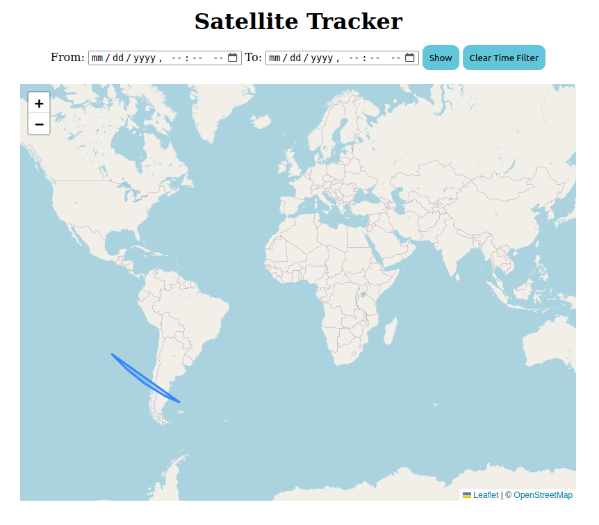

# Satellite-Tracker
Simple satellite tracker web application.

## Requirements
- Java: https://www.java.com/en/
  - this project uses Java 21
- Maven: https://maven.apache.org/
  - this project uses Maven 3.9.6

## How to run
Supposing you are in the root of the project, run the following commands:
```shell
mvn compile
```
```shell
java -cp target/classes hr.fer.zkist.lab02.SatelliteTrackerApplication
```
Open your favorite web browser and search for the following url address: `http://localhost:8080/`

## Demo
### Home screen
You can use date filters to search for specific satellites. Press `Show` button once you selected desired dates. If you wish to reset the map state like it was in the beginning, press the `Clear Time Filter` button.



## Architecture
Simple web application that serves static HTML, CSS and JS files via HTTP protocol (see `resources` folder).

### HTTP server
We are using simple `HttpServer` for serving static content. 
This simple server only accepts HTTP-GET requests (check `SatelliteTrackerApplication.java`):
```java
if (!exchange.getRequestMethod().equals("GET")) {
    exchange.sendResponseHeaders(405, 0);
    return;
}
```
Also, possible request paths are `/` (`index.html`), `/index.js` and `index.css`:
```java
String path = exchange.getRequestURI().getPath();
if (path.equals("/")) {
    path = "/index.html";
}
path = path.substring(1);
String contentType = path.endsWith("html") ? "text/html" : path.endsWith("css") ? "text/css" : "text/javascript";
```
Then, this is how you can create HTTP response that contains required file in the response body:
```java
byte[] response = new byte[]{};
try {
    response = Files.readAllBytes(
            Path.of(
                    Objects.requireNonNull(
                            this.getClass().getClassLoader().getResource(path)
                    ).toURI()
            )
    );
} catch (URISyntaxException e) {
    exchange.sendResponseHeaders(503, 0);
}

exchange.getResponseHeaders().add("Content-Type", contentType);
exchange.sendResponseHeaders(200, response.length);
OutputStream os = exchange.getResponseBody();
os.write(response);
os.close();
```

### Leaflet - open-source Javascript library for interactive map
Library that is used for showing satellites on the map is Leaflet: https://leafletjs.com/. 
In short, this is how you can initialize the map (check `index.js`):
```javascript
let map = L.map("map").setView([0, 0], 2);
L.tileLayer('https://tile.openstreetmap.org/{z}/{x}/{y}.png', {
    maxZoom: 19,
    attribution: '&copy; <a href="http://www.openstreetmap.org/copyright">OpenStreetMap</a>'
}).addTo(map);
```
Also, make sure you've included required CSS and JS files in your HTML document file:
```html
<link rel="stylesheet" href="https://unpkg.com/leaflet@1.9.4/dist/leaflet.css"
      integrity="sha256-p4NxAoJBhIIN+hmNHrzRCf9tD/miZyoHS5obTRR9BMY="
      crossorigin=""/>
<script src="https://unpkg.com/leaflet@1.9.4/dist/leaflet.js"
        integrity="sha256-20nQCchB9co0qIjJZRGuk2/Z9VM+kNiyxNV1lvTlZBo="
        crossorigin=""></script>
```
When we want to update the map with filtered satellite points, we do the following (check `setPathOnMap` function in `index.js`):
```javascript
const onShow = () => {
const startTime = new Date(document.getElementById("timeStart").value).getTime();
const endTime = new Date(document.getElementById("timeEnd").value).getTime();

const filtered = data
    .filter(record => record.ts >= startTime && record.ts <= endTime)
    .map(record => [record.lat, record.lon]);

setPathOnMap(filtered);
};
```
Finally, once we load our script file, map must be initialized with some data, and we simply call custom `initMap` function:
```javascript
const initMap = () => {
    setPathOnMap(data.map(record => [record.lat, record.lon]));
};
```
